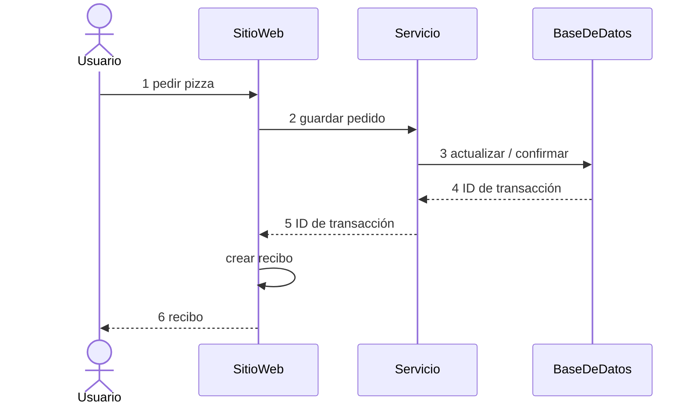
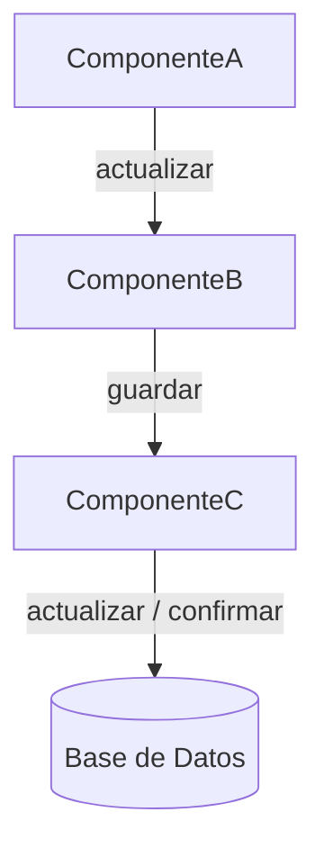
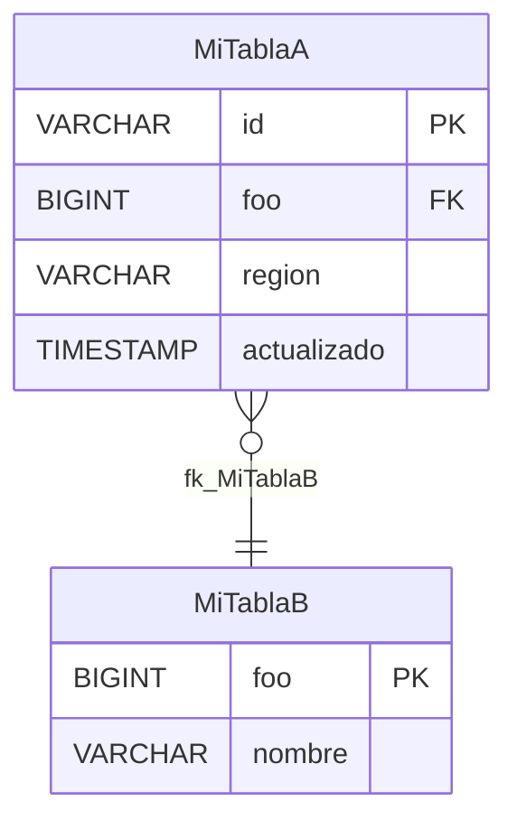

# Plantilla de Documento de Diseño Técnico

**ESTADO DEL DOCUMENTO:** REVISADO

*--- ELIMINAR ESTA SECCIÓN ---*

*Instrucciones:*

*Esta plantilla está destinada a ser utilizada por equipos de ingeniería para comunicar diseños técnicos de proyectos. Los equipos son libres de determinar qué proyectos merecen la elaboración de un documento de diseño técnico y la realización de sesiones de revisión; sin embargo, es una excelente manera de obtener retroalimentación valiosa de los interesados.*

*Siempre que su proyecto abarque múltiples sistemas, requiera algún tipo de participación de equipos externos, o tenga el potencial de impactos significativos en sus dependencias o servicios posteriores, debe crear un documento de diseño para ayudar a comunicarse con esos equipos externos.*

*Es posible que no todas las secciones apliquen a todos los proyectos; simplemente elimine las secciones que no apliquen. Los equipos son libres de determinar el nivel de detalle a incluir en sus diseños, por ejemplo, solo el enfoque de alto nivel o componentes detallados de bajo nivel, diagramas de clases y algoritmos. Proporcionar un documento de diseño claro y exhaustivo garantizará que reciba la mejor retroalimentación más útil de sus revisores. Esta plantilla está destinada a proporcionarle un punto de partida, un esquema y ejemplos de artefactos de diseño que puede elegir incluir.*

1. Copie esta plantilla en la carpeta apropiada para los proyectos de su equipo.
2. Reemplace "Plantilla de Documento de Diseño Técnico" con "Nombre de Su Proyecto - Diseño Técnico".
3. Complete los detalles de su diseño.
4. Agregue un enlace a su documento en la página wiki de su equipo.
5. Establezca el estado del documento en **EN REVISIÓN** y realice una revisión interna (con su equipo) y una revisión externa con todos sus interesados.
6. Capture las decisiones que se tomaron y por qué en el documento.
7. Capture las actas de las reuniones de revisión con cualquier elemento de acción en la sección de Actas de Revisión, y envíe esas actas a sus revisores.
8. Una vez que su documento haya sido revisado y haya atendido todos los comentarios y preguntas de los revisores, cambie el estado del documento a **REVISADO**, y luego muévalo al Wiki para que sea buscable por otros equipos.
   a. Exporte el contenido del documento a un archivo y cópielo y péguelo en una página Wiki, para que su proyecto sea buscable.
9. Incluya el enlace de la página Wiki de su proyecto en la página Wiki de su equipo (donde mantiene los enlaces de documentos para todos los proyectos del equipo). Esto facilitará encontrar su documento.
10. Actualice el documento wiki si alguna decisión importante cambia durante el transcurso de la implementación de su proyecto.

*--- FIN DE LA SECCIÓN A ELIMINAR ---*

---

## Resumen

*--- ELIMINAR ESTA SECCIÓN ---*

*Instrucciones:*

*En esta sección, proporcione una breve explicación del proyecto. Esto proporcionará a sus lectores el contexto para el resto de su documento. Debe incluir una descripción de quiénes son sus clientes y cómo los está ayudando. Si la subsección de Antecedentes tiene más de uno o dos párrafos, muévala al Apéndice A. Es posible que desee incluir un diagrama de arquitectura de los sistemas existentes como parte de los Antecedentes.*

*--- FIN DE LA SECCIÓN A ELIMINAR ---*

El resumen de su proyecto va aquí...

## Supuestos

*--- ELIMINAR ESTA SECCIÓN ---*

*Instrucciones:*

*Describa cualquier condición previa que se asume como verdadera y que es fundamental para el diseño de su sistema.*

*--- FIN DE LA SECCIÓN A ELIMINAR ---*

## Alcance y Fases

*--- ELIMINAR ESTA SECCIÓN ---*

*Instrucciones:*

*Si hay limitaciones o si el proyecto se está dividiendo en múltiples fases, proporcione esos detalles en esta sección. Si no hay fases y todos los requisitos se incluyen en la versión inicial, entonces elimine esta sección.*

*--- FIN DE LA SECCIÓN A ELIMINAR ---*

La Fase 1 incluye:

- ...algo en la fase 1...
- ...algo en la fase 1...

La Fase 2 incluye:

- ...algo en la fase 2...
- ...algo en la fase 2...

Fuera del alcance:

- ...algo fuera del alcance del proyecto...
- ...algo fuera del alcance del proyecto...

---

## 1. Requerimientos *(~5 minutos)*

*--- ELIMINAR ESTA SECCIÓN ---*

*El objetivo de esta sección es obtener una comprensión clara del sistema que se va a diseñar. Divida los requisitos en las tres subsecciones siguientes. Mantenga los requisitos enfocados: el objetivo del resto del documento es desarrollar un sistema que cumpla los requisitos identificados aquí, así que sea estratégico en su priorización.*

*--- FIN DE LA SECCIÓN A ELIMINAR ---*

### 1.1 Requerimientos Funcionales

*--- ELIMINAR ESTA SECCIÓN ---*

*Los requisitos funcionales son declaraciones del tipo "Los usuarios/clientes deben poder...". Estas son las características principales del sistema y deben ser lo primero que discuta con sus interesados. Haga preguntas dirigidas como si estuviera hablando con un cliente o gerente de producto ("¿el sistema necesita hacer X?", "¿qué pasaría si Y?") para llegar a una lista priorizada de características principales.*

*Mantenga su lista enfocada. Muchos de estos sistemas tienen cientos de funcionalidades, pero su trabajo es identificar y priorizar las 3 más importantes. Una lista larga perjudicará más que ayudará.*

*Ejemplos:*

- *Los usuarios deben poder publicar mensajes.*
- *Los usuarios deben poder seguir a otros usuarios.*
- *Los usuarios deben poder ver el contenido de los usuarios que siguen.*

*--- FIN DE LA SECCIÓN A ELIMINAR ---*

1. Los usuarios deben poder...
2. Los usuarios deben poder...
3. Los usuarios deben poder...

### 1.2 Requerimientos No Funcionales

*--- ELIMINAR ESTA SECCIÓN ---*

*Los requisitos no funcionales son declaraciones sobre las cualidades del sistema importantes para sus usuarios. Se pueden formular como "El sistema debe..." o "El sistema debe ser...". Es importante que estén contextualizados y, donde sea posible, cuantificados. Por ejemplo, "el sistema debe ser de baja latencia" es obvio y poco significativo. "El sistema debe tener búsqueda de baja latencia, < 500 ms" es más útil.*

*Identifique los 3 a 5 más relevantes para su sistema. Considere los siguientes aspectos:*

1. *Teorema CAP: ¿Su sistema debe priorizar consistencia o disponibilidad? Recuerde que la tolerancia a particiones se da por sentada en sistemas distribuidos.*
2. *Restricciones de Entorno: ¿Existen restricciones en el entorno de ejecución? Por ejemplo, ¿ejecuta en dispositivos móviles con batería limitada, memoria limitada o ancho de banda limitado?*
3. *Escalabilidad: ¿Tiene requisitos únicos de escalado, como tráfico en ráfagas a cierta hora, o eventos que causen un aumento significativo de tráfico? Considere también la proporción de lecturas vs escrituras.*
4. *Latencia: ¿Qué tan rápido debe responder el sistema? Identifique específicamente las operaciones que requieren cómputo significativo.*
5. *Durabilidad: ¿Qué tan importante es que los datos no se pierdan? Un sistema bancario no puede tolerar pérdida de datos; una red social quizás sí.*
6. *Seguridad: ¿Qué tan seguro debe ser el sistema? Considere protección de datos, control de acceso y cumplimiento normativo.*
7. *Tolerancia a Fallos: ¿Cómo debe manejar el sistema las fallas? Considere redundancia, failover y mecanismos de recuperación.*
8. *Cumplimiento: ¿Hay requisitos legales o normativos que el sistema deba cumplir? Considere estándares de la industria y leyes de protección de datos.*

*--- FIN DE LA SECCIÓN A ELIMINAR ---*

1. El sistema debe ser altamente disponible, priorizando disponibilidad sobre consistencia (CAP).
2. El sistema debe ser capaz de escalar para soportar [N] usuarios activos diarios (DAU).
3. El sistema debe tener baja latencia en [operación crítica], con tiempos de respuesta menores a [X ms].

### 1.3 Estimación de Capacidad

*--- ELIMINAR ESTA SECCIÓN ---*

*Realice estimaciones de capacidad únicamente si influirán directamente en su diseño. En la mayoría de los escenarios, está tratando con un sistema distribuido a gran escala y es razonable asumirlo. Reserve los cálculos para cuando la decisión de diseño dependa realmente de los números.*

*Si necesita estimar, considere:*

- *Usuarios Activos Diarios (DAU)*
- *Consultas por Segundo (QPS) — lectura y escritura*
- *Almacenamiento requerido*
- *Ancho de banda de red*

*Ejemplo de cálculo de tráfico:*

```text
10 TPS * 50 MB = 500 MB por Segundo
60 s/min  * 500 MB/s  = 30 GB por Minuto
60 min/h  * 30 GB/min = 1.8 TB por Hora
24 h/día  * 1.8 TB/h  = 43.2 TB por Día
```

*--- FIN DE LA SECCIÓN A ELIMINAR ---*

---

## 2. Entidades Principales *(~2 minutos)*

*--- ELIMINAR ESTA SECCIÓN ---*

*Identifique y enumere las entidades principales de su sistema. Esto le ayuda a definir términos, comprender los datos centrales de su diseño y establece una base sobre la cual construir. Estas son las entidades que su API intercambiará y que su sistema persistirá en un modelo de datos.*

*Empiece con una lista pequeña; a medida que diseñe el sistema, descubrirá nuevas entidades y relaciones. Una vez que tenga el diseño de alto nivel más claro, podrá comenzar a construir la lista de campos/columnas relevantes para cada entidad.*

*Preguntas útiles:*

- *¿Quiénes son los actores del sistema? ¿Se superponen?*
- *¿Cuáles son los sustantivos o recursos necesarios para satisfacer los requisitos funcionales?*

*Ejemplos para un sistema de mensajería:*

- *Usuario*
- *Mensaje*
- *Conversación*

*--- FIN DE LA SECCIÓN A ELIMINAR ---*

- ...
- ...
- ...

---

## 3. API o Interfaz del Sistema *(~5 minutos)*

*--- ELIMINAR ESTA SECCIÓN ---*

*Defina el contrato entre su sistema y sus usuarios antes de entrar en el diseño de alto nivel. Este contrato guiará el diseño y asegurará que se cumplan los requisitos identificados.*

*Elija el protocolo de API adecuado:*

- *REST (Transferencia de Estado Representacional): Usa verbos HTTP (GET, POST, PUT, DELETE) para operaciones CRUD sobre recursos. Debe ser su elección predeterminada para la mayoría de los casos.*
- *GraphQL: Permite a los clientes especificar exactamente qué datos necesitan, evitando sobre-obtención. Elija esto cuando tenga clientes diversos con diferentes necesidades de datos.*
- *RPC (Llamada a Procedimiento Remoto, e.g. gRPC): Protocolo orientado a acciones, más rápido que REST para comunicación servicio a servicio. Use para APIs internas donde el rendimiento es crítico.*

*Para características en tiempo real, también necesitará WebSockets o Server-Sent Events, pero diseñe primero su API principal.*

*Nunca confíe en información sensible como IDs de usuario en los cuerpos de solicitud cuando deben provenir del token de autenticación. Siempre autentique las solicitudes y derive el usuario actual del token, no de la entrada del usuario.*

*Para cada API nueva o actualizada, incluya:*

- *Nombre(s) de Operación*
- *Parámetro(s) de Solicitud / Entrada*
- *Parámetro(s) de Respuesta / Salida*
- *Excepción(es) y sus códigos de estado HTTP*
- *Estructura de cualquier Tipo de Dato(s) Complejo(s)*
- *Restricciones en Parámetros Opcionales/Requeridos*

*Asegúrese de abordar las preocupaciones de validación de datos para prevenir ataques de inyección SQL o de scripts (por ejemplo, no se permiten caracteres `;`, todas las cadenas escapadas para etiquetas HTML).*

*Tipos de APIs afectadas:*

- *APIs Públicas*
- *APIs Internas*

*Ejemplo (REST):*

```
POST /v1/recursos
body: {
  "campo": string
}

GET /v1/recursos/{recursoId} -> Recurso

PUT /v1/recursos/{recursoId}
body: {
  "campo": string
}

DELETE /v1/recursos/{recursoId}
```

*--- FIN DE LA SECCIÓN A ELIMINAR ---*

---

## 4. Flujo de Datos *(~5 minutos)* [Opcional]

*--- ELIMINAR ESTA SECCIÓN ---*

*Para algunos sistemas de backend, especialmente los sistemas de procesamiento de datos, puede ser útil describir la secuencia de alto nivel de acciones o procesos que el sistema realiza sobre las entradas para producir las salidas deseadas. Si su sistema no involucra una larga secuencia de acciones, omita esta sección.*

*Los diagramas de secuencia son una excelente manera de comunicar los detalles de los flujos de llamadas entre sistemas o componentes. En sus diagramas, incluya flujos alternativos y agrupe las llamadas que ocurren en paralelo.*

*Los gráficos de flujo de datos son útiles cuando se desarrollan flujos complejos de procesamiento por lotes o streaming. A diferencia de los diagramas de secuencia, no describen el flujo de control (bucles, ramas); use en cambio un diagrama de actividad o diagrama de flujo para esos elementos.*

*--- FIN DE LA SECCIÓN A ELIMINAR ---*

Fuente del Diagrama



---

## 5. Diseño de Alto Nivel *(~10-15 minutos)*

*--- ELIMINAR ESTA SECCIÓN ---*

*Ahora que tiene una comprensión clara de los requisitos, entidades y API de su sistema, puede comenzar a diseñar la arquitectura de alto nivel. Consiste en dibujar cajas y flechas que representen los diferentes componentes del sistema y cómo interactúan.*

*Su objetivo principal es diseñar una arquitectura que satisfaga la API que ha diseñado y, por lo tanto, los requisitos identificados. Puede ir uno por uno a través de sus endpoints de API y construir su diseño secuencialmente para satisfacer cada uno.*

*Manténgase enfocado. Es muy común comenzar a agregar complejidad demasiado pronto. Concéntrese en un diseño relativamente simple que cumpla los requisitos funcionales principales, y luego añada complejidad para satisfacer los requisitos no funcionales en la sección de Inmersiones Profundas.*

*Documente las entidades relevantes (columnas/campos) directamente junto al componente de persistencia en el diagrama. Enfóquese en los campos específicos relevantes para su diseño, no en los obvios.*

*¿Los componentes se ejecutarán en infraestructura existente? ¿O aprovisionará nueva infraestructura? ¿Configurará nuevas canalizaciones de despliegue, o usará las existentes?*

*--- FIN DE LA SECCIÓN A ELIMINAR ---*

### Componentes

*--- ELIMINAR ESTA SECCIÓN ---*

*Explique los componentes que está agregando o modificando y cómo interactúan con otros. Un diagrama de componentes es un artefacto de diseño útil para comunicar eficientemente los detalles.*

*En los diagramas de componentes, elija una convención consistente para las flechas:*

- *Flujo de Llamadas — Llamador → Llamado*
- *Flujo de Datos — Origen → Destino*

*Asegúrese de incluir el código fuente de sus diagramas para que otros puedan editarlos posteriormente.*

*--- FIN DE LA SECCIÓN A ELIMINAR ---*

Ejemplo (PlantUML):

Fuente del Diagrama



### Temporización

*--- ELIMINAR ESTA SECCIÓN ---*

*Si está realizando cambios en los flujos de llamadas donde la latencia es crítica y puede verse afectada, explique los impactos de latencia de sus cambios. De lo contrario, elimine esta sección. Los diagramas de temporización son una forma conveniente de describir la latencia en múltiples pasos.*

*--- FIN DE LA SECCIÓN A ELIMINAR ---*

Ejemplo (PlantUML):

Fuente del Diagrama

_El diagrama de temporización de ejemplo va aquí._

---

## 6. Inmersiones Profundas *(~10 minutos)*

*--- ELIMINAR ESTA SECCIÓN ---*

*Ahora que tiene un diseño de alto nivel, use el tiempo restante para fortalecer su diseño:*

- *Garantizar que se cumplan todos los requisitos no funcionales.*
- *Abordar casos extremos.*
- *Identificar y resolver problemas y cuellos de botella.*
- *Mejorar el diseño basándose en retroalimentación de los revisores.*

*El grado en que lidera proactivamente las inmersiones profundas es proporcional a la senioridad del proyecto. Para proyectos más maduros, el equipo debe ser capaz de identificar estas áreas de forma autónoma y liderar la discusión.*

*Incluya las subsecciones más relevantes para su proyecto y elimine las que no apliquen.*

*--- FIN DE LA SECCIÓN A ELIMINAR ---*

### 6.1 Esquema de Base de Datos

*--- ELIMINAR ESTA SECCIÓN ---*

*Si necesita realizar cambios de esquema en cualquier almacén de datos existente (por ejemplo, bases de datos NoSQL, MySQL), explique qué cambios se realizan y cómo se mantiene la compatibilidad con versiones anteriores con cualquier componente de software que acceda directamente a los datos. Incluya también una explicación de cualquier actividad de migración de datos.*

*Hay varias formas convenientes de representar el esquema:*

- *Tabla Simple*
- *Diagramas ER de PlantUML*
- *Diagramas ER de DrawIO*

*Asegúrese de incluir el código fuente de su diagrama como enlace en este documento.*

*--- FIN DE LA SECCIÓN A ELIMINAR ---*

Ejemplo (Tabla Simple):

**Tabla: Mi Tabla de Base de Datos**

| Columna | Tipo | Restricciones | Descripción |
|---|---|---|---|
| id | VARCHAR | PK, NOT NULL | ID único |
| foo | BIGINT |  | La cosa que va antes de Bar |
| bar | TIMESTAMP |  | La cosa que va después de Foo |

Ejemplo (Diagrama ER PlantUML):

Fuente del Diagrama



Ejemplo (Diagrama ER DrawIO):

Fuente del Diagrama

| MiTablaA | MiTablaB |
|---|---|
| PK id VARCHAR | PK foo BIGINT |
| FK foo BIGINT | bar BIGINT |
| actualizado TIMESTAMP | nombre VARCHAR |

### 6.2 Escalabilidad e Infraestructura

*--- ELIMINAR ESTA SECCIÓN ---*

*¿Cómo escala su sistema a medida que crece la demanda? ¿Qué estrategias de escalado horizontal o vertical empleará? ¿Qué límites de servicio podría encontrar? ¿Cuánta concurrencia provisionada o capacidad de lectura/escritura necesitará?*

*¿Los componentes se ejecutarán en una cuenta de nube existente? ¿O aprovisionará nuevas cuentas para alojar estos componentes?*

*¿Cuánto costará operar este servicio? Utilice las fórmulas a continuación para calcular un costo estimado. No tiene que ser exacto; el objetivo es estar dentro de un orden de magnitud. Agregue estimaciones similares para cualquier servicio adicional que utilice.*

**Total**

La suma de todos los servicios multiplicada por el número de pares de región/etapa en los que operará el servicio.

```text
sumaDeTodosLosServicios * paresDeRegionEtapa = dólaresPorMes
```

**Función Serverless**

```text
memoriaFunciónGB * duraciónPromedio * TPS * costoPorGB-s * 3600 * 24 * 30 = dólaresPorMes
```

**Almacenamiento de Objetos**

```text
tamañoCuboTB * costoPorTB = dólaresPorMes
```

**Base de Datos NoSQL - Almacenamiento**

```text
tamañoTablaTB * costoPorTB = dólaresPorMes
```

**Base de Datos NoSQL - Lecturas**

```text
lecturasPorSegundo * costoPorLectura * 3600 * 24 * 30 = dólaresPorMes
```

**Base de Datos NoSQL - Escrituras**

```text
escriturasPorSegundo * costoPorEscritura * 3600 * 24 * 30 = dólaresPorMes
```

*¿Cuál es el flujo de tráfico de red esperado? Calcule el flujo de tráfico de red esperado para su servicio en un segundo, minuto, hora y día determinados. Tenga en cuenta las cuotas/límites dentro de la región y el tráfico de red entre regiones.*

*--- FIN DE LA SECCIÓN A ELIMINAR ---*

### 6.3 Métricas y Monitoreo

*--- ELIMINAR ESTA SECCIÓN ---*

*¿Cómo medirá el éxito operativo de sus cambios? ¿Qué métricas utilizará? Si hay una falla, ¿cómo lo sabría alguien? ¿Requeriría un examen manual de las métricas en los paneles de control para identificar un problema (enfoque deficiente) o crearía automáticamente un ticket para el equipo de guardia correspondiente que contiene un enlace al procedimiento estándar de operación apropiado (buen enfoque)?*

*Si está agregando o modificando métricas a algún sistema, inclúyalas aquí. Si está agregando o modificando alarmas, inclúyalas aquí. Incluya enlaces a cualquier panel de control operativo o procedimiento estándar de operación pertinente. Cualquier cosa que no haya sido creada aún puede dejarse como TBD.*

*--- FIN DE LA SECCIÓN A ELIMINAR ---*

Ejemplos:

| Sistema | Métrica | Umbral de Alarma | CTI | Enlaces | Descripción |
|---|---|---|---|---|---|
| ServicioEntrada | Tiempo | > 750 milisegundos | Categoría / Tipo / Elemento | Panel de Control | Umbral de latencia del lado del servidor actualizado para dar cuenta de X. |
| ServicioEntrada | TasaDeLlenado (nueva) | < .1 | Categoría / Tipo / Elemento | TBD | Nueva métrica de tasa de llenado agregada. Cuando esté por debajo del 10%, el equipo de guardia debe examinar la entrega de elementos de línea. |

### 6.4 Seguridad

*--- ELIMINAR ESTA SECCIÓN ---*

*¿Ha pasado su servicio por una revisión de seguridad de aplicaciones? Si no, ese es un requisito para un servicio en producción. ¿Está realizando cambios que deberían merecer una nueva revisión de seguridad o actualizaciones a cualquier Modelo de Amenazas existente?*

*¿Está agregando nuevos puntos de entrada al límite del sistema, como crear una nueva API pública o nueva página web, que podría proporcionar un nuevo vector de ataque potencial? Si es así, es posible que desee configurar Pruebas de Penetración. Si está tomando entradas de los usuarios, ¿está validando los datos para prevenir inyección SQL o de scripts?*

*--- FIN DE LA SECCIÓN A ELIMINAR ---*

### 6.5 Extensibilidad

*--- ELIMINAR ESTA SECCIÓN ---*

*¿Cómo se verá su servicio en tres años? ¿Qué necesitará soportar entonces que no soporta ahora? ¿Qué nunca soportará, y por qué no? ¿Cómo se verá cuando tenga un uso 10 veces mayor? ¿Cómo se verá cuando tenga un uso 100 veces mayor? ¿Cómo gestionará el inevitable requisito de romper la compatibilidad con versiones anteriores en una interfaz o formato de datos? ¿Cómo funcionará su servicio en nuevas regiones o nuevas particiones?*

*--- FIN DE LA SECCIÓN A ELIMINAR ---*

### 6.6 Arquitectura a Mayor Escala

*--- ELIMINAR ESTA SECCIÓN ---*

*¿Con qué otros componentes se superpone funcionalmente su servicio? ¿Qué partes de esos servicios deberían moverse para estar en su servicio? ¿Qué partes de su servicio deberían moverse para convertirse en parte de otros servicios? ¿Qué partes deben permanecer separadas porque necesitarán cambiar de forma independiente o el costo de fusionarlas es demasiado alto?*

*--- FIN DE LA SECCIÓN A ELIMINAR ---*

### 6.7 Proceso de Lanzamiento

*--- ELIMINAR ESTA SECCIÓN ---*

*¿Cómo lanzará su proyecto?*

*¿Cómo se despliega su software a producción? ¿Qué canalizaciones están involucradas? ¿Necesitan desplegarse en cierto orden (no deberían)? ¿Puede alguna de ellas revertirse de forma independiente, sin causar una interrupción?*

*¿Necesita su proyecto ser activado gradualmente bajo un proceso de control de cambios? Si es así, ¿qué equipos de interesados deben ser incluidos como aprobadores? ¿A quién se debe notificar?*

*--- FIN DE LA SECCIÓN A ELIMINAR ---*

### 6.8 Despliegues Regionales

*--- ELIMINAR ESTA SECCIÓN ---*

*¿En qué regiones está desplegando?*

*¿Todos sus stages regionales tienen todos los servicios que necesita? ¿Omitirá regiones que no ofrecen todos los servicios necesarios, o invertirá en una solución alternativa?*

*--- FIN DE LA SECCIÓN A ELIMINAR ---*

### 6.9 Retención de Datos

*--- ELIMINAR ESTA SECCIÓN ---*

*¿Por cuánto tiempo necesita retener datos para su sistema? ¿Tiene una política de retención y eliminación definida?*

*¿Dónde crea y persiste datos su sistema? ¿Tiene una estrategia de retención/gestión de datos para cada sistema de persistencia de datos?*

*¿Qué costo de almacenamiento proyecta gastar mensual/anualmente? ¿Qué tan rápido aumentará el volumen de almacenamiento?*

*--- FIN DE LA SECCIÓN A ELIMINAR ---*

### 6.10 Metodología de Pruebas

*--- ELIMINAR ESTA SECCIÓN ---*

*¿Cómo probará sus cambios? ¿Qué pruebas automatizadas implementará para asegurarse de que no haya regresiones en su código después del lanzamiento del proyecto? En esta sección, puede incluir una explicación de:*

- *Procedimientos estándar de operación (SOPs) para pruebas manuales.*
- *Dependencias para pruebas de integración.*
- *Cobertura de pruebas de integración.*
- *Etapas de canalización donde se ejecutarán sus pruebas de integración para evitar que las regresiones se desplieguen.*
- *Trabajos programados para verificar la calidad de los datos en los informes.*
- *Pruebas automatizadas de interfaz de usuario e infraestructura.*
- *Pruebas de carga para simular grandes volúmenes de tráfico.*

*--- FIN DE LA SECCIÓN A ELIMINAR ---*

La cobertura de pruebas incluirá ...

Se están implementando las siguientes dependencias para habilitar las pruebas...

### 6.11 Dependencias

*--- ELIMINAR ESTA SECCIÓN ---*

*Enumere los sistemas (que no sean los que posee su equipo) que deben cambiar para entregar este proyecto. ¿Qué equipos son propietarios de estos sistemas? ¿Los ha involucrado? ¿Están de acuerdo con su diseño? ¿Se han comprometido a entregar los cambios que necesita en el plazo requerido?*

*Si sus cambios están completamente en sistemas que posee su equipo, puede eliminar esta sección o poner "Ninguno."*

*--- FIN DE LA SECCIÓN A ELIMINAR ---*

- TBD

### 6.12 Operaciones

*--- ELIMINAR ESTA SECCIÓN ---*

*¿Qué partes de su sistema necesitarán intervención del operador en el curso normal del negocio, una vez que el sistema esté funcionando en producción? ¿Qué libros de operaciones necesitará escribir para ejecutar estas intervenciones? ¿Qué herramientas tiene, o necesitará escribir, para hacer estas intervenciones fáciles y correctas?*

*¿Cuál será su primer punto de entrada para verificar si su sistema está funcionando correctamente? ¿Qué widgets tendrá?*

*--- FIN DE LA SECCIÓN A ELIMINAR ---*

---

## Temas de Discusión

*--- ELIMINAR ESTA SECCIÓN ---*

*Instrucciones:*

*Agregue una subsección para cada problema técnico que enfrente al entregar los requisitos, las opciones que ha considerado, sus respectivos compromisos (pros/contras) y la conclusión a la que llegó. Marque la opción que ha seleccionado como **RECOMENDADA**, para que los revisores puedan centrarse y dedicar más tiempo a examinar esa opción.*

*--- FIN DE LA SECCIÓN A ELIMINAR ---*

### Tema de Discusión: El título para la decisión técnica a tomar va aquí.

Aquí hay una explicación del problema y aquí hay algunas opciones...

- Opción 1 [RECOMENDADA] - Aquí hay un título para la opción 1, que es la solución propuesta.
- Opción 2 - Aquí hay un título para la opción 2.
- Opción 3 - Aquí hay un título para la opción 3.

#### Opción 1 [RECOMENDADA] - Aquí hay un título para la opción 1.

En este enfoque, ...los detalles van aquí junto con cualquier artefacto de diseño útil...

**Pros:**

- Aquí hay una razón por la que deberíamos usar este enfoque.
- Aquí hay otra razón por la que deberíamos usar este enfoque.

**Contras:**

- Aquí hay una razón por la que este enfoque no es ideal.
- Aquí hay otra razón.

#### Opción 2 - Aquí hay un título para la opción 2.

En este enfoque, ...los detalles van aquí junto con cualquier artefacto de diseño útil...

**Pros:**

- Aquí hay una razón por la que deberíamos usar este enfoque.
- Aquí hay otra razón por la que deberíamos usar este enfoque.

**Contras:**

- Aquí hay una razón por la que este enfoque no es ideal.
- Aquí hay otra razón.

#### Opción 3 - Aquí hay un título para la opción 3.

En este enfoque, ...los detalles van aquí junto con cualquier artefacto de diseño útil...

**Pros:**

- Aquí hay una razón por la que deberíamos usar este enfoque.
- Aquí hay otra razón por la que deberíamos usar este enfoque.

**Contras:**

- Aquí hay una razón por la que este enfoque no es ideal.
- Aquí hay otra razón.

**Conclusión**

Dada la consideración de las opciones y sus respectivos compromisos, hemos decidido optar por la Opción 1, porque ...

---

## Interesados

*--- ELIMINAR ESTA SECCIÓN ---*

*Instrucciones:*

*Enumere los equipos (que no sean el suyo) que se ven afectados por este proyecto. Esto describe quién debe ser incluido en las revisiones de diseño y procesos de control de cambios.*

*--- FIN DE LA SECCIÓN A ELIMINAR ---*

- TBD

## Contactos

*--- ELIMINAR ESTA SECCIÓN ---*

*Instrucciones:*

*Enumere los contactos clave para obtener más información sobre este proyecto. Esto debe incluir el Gerente de Producto, el Gerente de Ingeniería, el Gerente de Programa Técnico y el/los desarrollador(es) técnico(s) principal(es).*

*--- FIN DE LA SECCIÓN A ELIMINAR ---*

- Líder Técnico / Autor - ...enlace de perfil aquí...
- Gerente de Producto (PM) - ...
- Gerente de Programa Técnico (TPM) - ...
- Gerente de Ingeniería (SDM) - ...

---

## Apéndice

### Apéndice A - Antecedentes

*--- ELIMINAR ESTA SECCIÓN ---*

*Instrucciones:*

*Si su proyecto requiere que el lector tenga información significativa de contexto, entonces póngala aquí en el apéndice. De lo contrario, puede eliminar esta sección.*

*--- FIN DE LA SECCIÓN A ELIMINAR ---*

### Apéndice B - Actas de Revisión

*--- ELIMINAR ESTA SECCIÓN ---*

*Instrucciones:*

*Capturar las actas de las reuniones de revisión es una buena manera de registrar las decisiones acordadas y ganar la confianza de sus revisores.*

*Las actas deben incluir:*

- Fecha de revisión
- Asistentes - Si no registró todas las personas específicas, al menos describa qué equipos estuvieron representados
- Comentarios / Preguntas Respondidas
- Elementos de Acción con Responsables

Ejemplo:

**Revisión (30/06/2020):**

**Asistentes:**

- Equipo de Ingeniería de Datos
- Equipo de Operaciones de Seguridad

**Comentarios:**

• Todos los asistentes están de acuerdo con la opción técnica 1.
• X tiene una preocupación de que Y; nos aseguraremos de Z.

Acciones:
• nombre@: Cambiar los desgloses de trabajo basados en el alcance del proyecto recién actualizado.

*--- FIN DE LA SECCIÓN A ELIMINAR ---*
